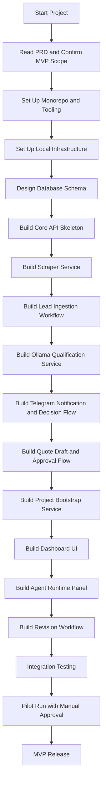
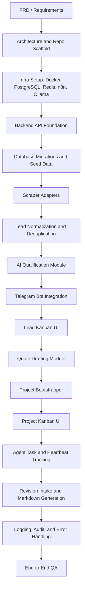
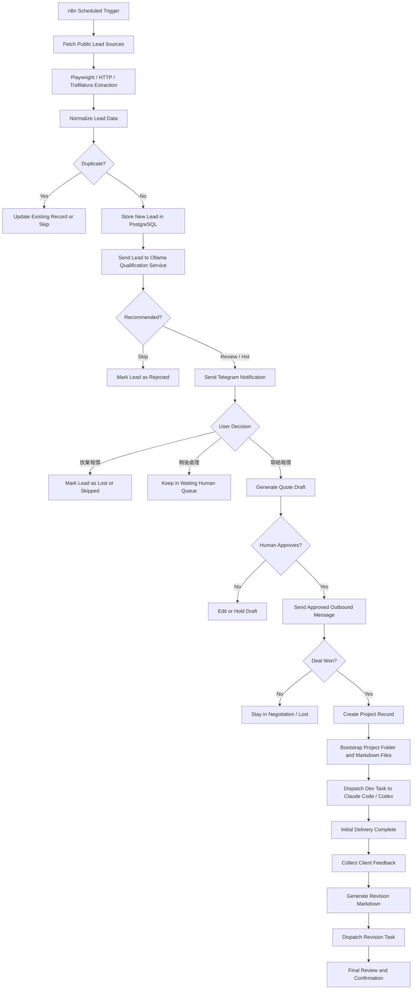
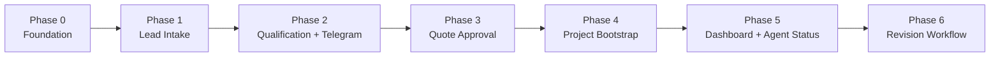
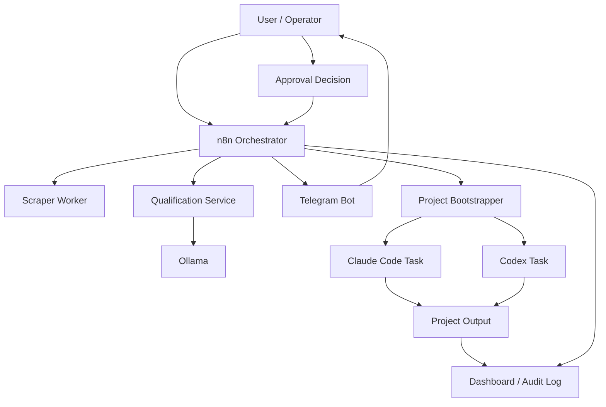

# Local AI Freelance Agency OS Development Flow

This document defines the recommended development flow for building the project in phases. It is intended for the project owner, Claude Code, Codex, and any future agents participating in implementation.

## 1. Development Flow Overview

## 2. Engineering Workstream Flow

## 3. Runtime Product Flow

## 4. Recommended Implementation Phases

## 5. Agent Collaboration Flow

## 6. Build Order for Claude Code

1. Scaffold monorepo and package layout.
2. Add Docker Compose with PostgreSQL, Redis, n8n, and Ollama.
3. Add Prisma schema and baseline migrations.
4. Implement API health routes and shared config.
5. Implement source config and lead ingestion.
6. Implement scraper adapters and normalization pipeline.
7. Implement Ollama qualification service with strict JSON validation.
8. Implement Telegram webhook and outbound notification flow.
9. Implement quote drafting and approval states.
10. Implement project bootstrapper and markdown templates.
11. Implement dashboard Kanban views.
12. Implement agent runtime panel and audit log views.
13. Implement revision intake and revision task generation.

## 7. Notes

- Human approval must remain in the loop for customer-facing outbound messages during MVP.
- Scraping behavior must stay within platform rules and should focus on public pages only.
- The dashboard should separate lead pipeline status from project delivery status.
- Agent observability should track current task, last heartbeat, and blocked state.
